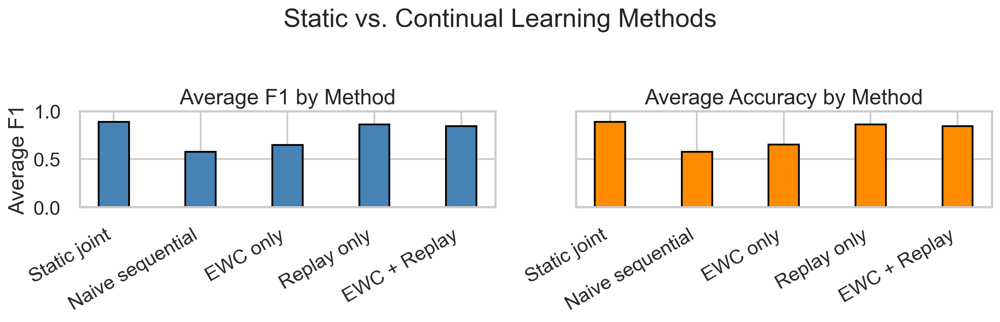
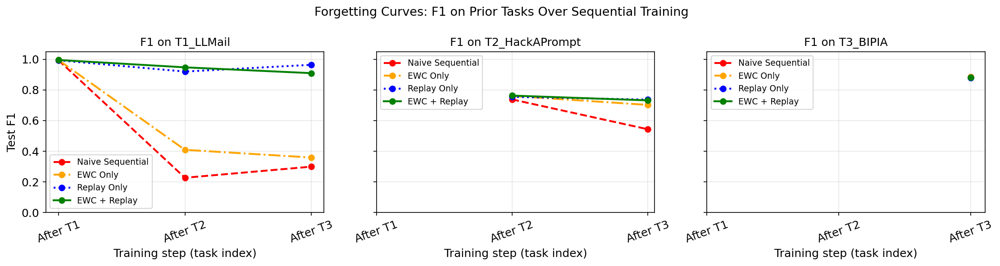
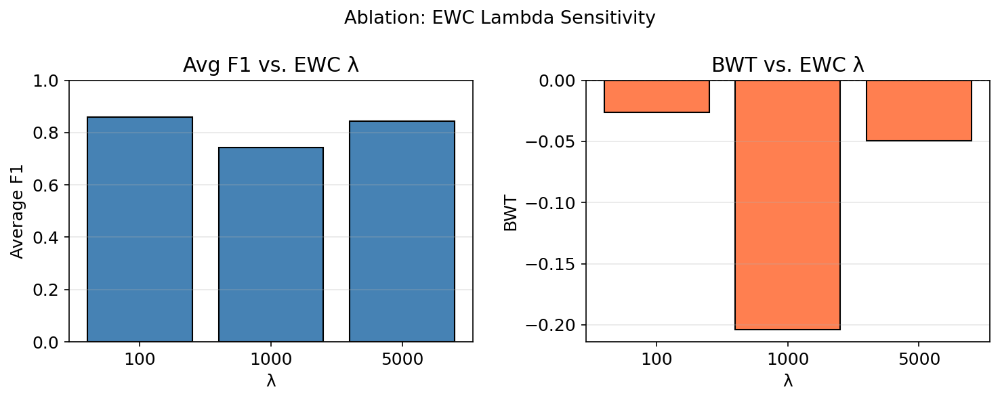
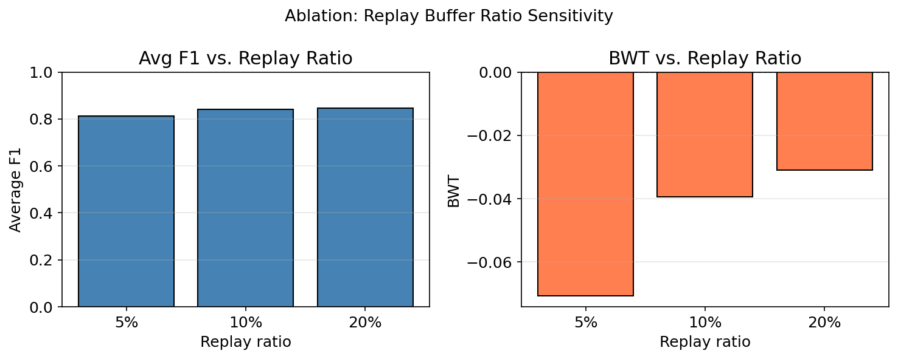
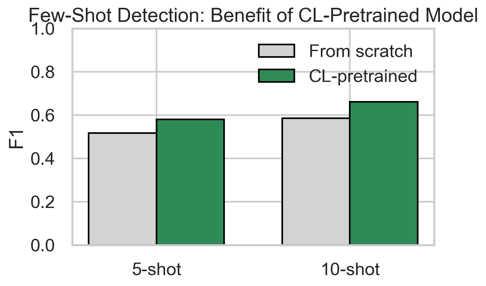

# ANTIDOTE: Adaptive Continual Learning for Detecting Evolving Prompt Injection Attacks.

Author : [Oluwadabira Omotoso](https://dabby04.github.io/professional-journey/)

[](#paper)
[](#video)

Large Language Models (LLMs) are increasingly deployed in real-world applications, making them attractive targets for prompt injection attacks, which OWASP currently ranks as the top security risk for LLM systems. Existing detection methods are fundamentally static, trained once on fixed datasets and unable to adapt as attack patterns evolve, leading to catastrophic forgetting when exposed to new attack distributions. This paper proposes ANTIDOTE, a continual learning framework for prompt injection detection that combines Elastic Weight Consolidation (EWC) and experience replay to enable a DeBERTa-v3-base classifier to adapt sequentially across evolving attack types without forgetting previously learned detection capability. We evaluate our framework across three sequential tasks derived from publicly available benchmarks, LLMail-Inject, HackAPrompt, and BIPIA, representing a progression from targeted structured attacks to stylistically diverse jailbreaks to contextually embedded indirect injections. EWC combined with experience replay achieves an average F1 of 0.8408 and a backward transfer of -0.0584, substantially outperforming naive sequential fine-tuning (0.5763, -0.4438) and approaching the static joint upper bound (0.8889). Few-shot zero-day evaluation further demonstrates that continual pretraining improves adaptation to unseen attack types by up to 15% over a from-scratch baseline.



## Project Objective

ANTIDOTE is designed to answer one practical question: can a prompt-injection detector keep learning new attack distributions without erasing what it already knows?

The project objective is to:

1. Simulate realistic attack evolution across three sequential task distributions.
2. Quantify forgetting versus adaptation with task-wise F1, average F1, and backward transfer.
3. Compare static, naive sequential, and continual-learning baselines under the same data pipeline.
4. Validate whether combined EWC + replay gives a stable, deployable tradeoff for evolving prompt-injection defense.

## Experimental Setup

The project compares five training methods:

1. `static_joint`: all tasks trained jointly, used as an upper-bound reference.
2. `naive_sequential`: fine-tune on T1, then T2, then T3.
3. `ewc_only`: sequential training with Elastic Weight Consolidation.
4. `replay_only`: sequential training with experience replay.
5. `ewc_plus_replay`: the ANTIDOTE method, combining EWC and replay.

The default model is `microsoft/deberta-v3-base`. The training pipeline uses a maximum sequence length of 256 and standard train/validation/test splits of 70/15/15 per task.

## Getting Started

### Dependencies
---

The notebooks manage their own Python-side setup in-cell, so the reproduction instructions below describe the notebook environment explicitly instead of duplicating a repo-wide Python install list here.


### Reproducing The Experiments
---

Run the notebooks in the order below. Each step writes artifacts that the later notebooks use, so this is best treated like a staged research pipeline rather than a set of isolated notebooks.

### Notebook Environment

The notebooks were authored to run in Kaggle or Colab with mounted datasets.

For a clean reproduction session:

1. Start a fresh Kaggle or Colab notebook.
2. Attach or upload the required datasets used by the notebooks, including the three task parquet files and any prior-result datasets referenced by the analysis notebooks.
3. Keep the notebook-local install cells that pull the few Python packages needed for that notebook run.
4. Ensure model and result paths point to the notebook working directory, such as `/kaggle/working/` for Kaggle or the mounted Drive path for Colab.
5. If you are using Kaggle, store the Hugging Face token in `Add-ons > Secrets` and authenticate before loading checkpoints or tokenizers.
6. If you are using Colab, store the Hugging Face token in Colab Secrets, mount Google Drive, keep the repo and datasets in Drive, and authenticate before loading checkpoints or tokenizers.

This repository intentionally preserves the notebook setup code because it documents the exact execution context for the experiments.

### Compute And Reliability Notes

- A GPU runtime is strongly recommended for experiment notebooks (especially continual-learning stages with DeBERTa-v3-base). Most of these experiements cannot be run on a CPU.
- Use Kaggle GPU or Colab GPU sessions with enough VRAM to avoid frequent out-of-memory interruptions (GPU T4 preferred).
- Several training notebooks include checkpoint save/load flow so interrupted runs can resume from previous task instead of restarting from scratch.
- The repo also keeps memory-aware/OOM-safe execution patches in notebook code paths. Without these patches, you will run into some out of memory errors. 
- For long cloud sessions, persist outputs/checkpoints to durable storage (`/kaggle/working` artifacts or mounted Google Drive) so timeout resets do not discard progress. If using kaggle, would advice to run notebooks using `Save and Run All (Commit)`. If using Colab, using the javascript timeout trick.

### Stage 1: Data Preparation

- `01-data-prep.ipynb`

This notebook prepares the three task datasets and the splits used throughout the project. The outputs support all later baselines and continual-learning runs.

### Stage 2: Baseline Comparisons

- `02-baselines.ipynb`

This produces the non-continual reference results:

- `static_joint`
- `naive_sequential`

The saved output is:

- `results/results-baselines/results_baselines.json`

### Stage 3: Continual Learning Runs

- `03-continual-learning.ipynb`
- `04-replay-only.ipynb`
- `05-ewc-replay.ipynb`

These notebooks train the continual-learning variants task by task and save the intermediate checkpoints needed for the demo and the later ablations. The main result files are:

- `results/results-ewc-only/results_cl.json`
- `results/results-replay-only/results_cl_replay.json`
- `results/results-ewc+replay/results_cl_ewc_replay.json`

### Stage 4: Comparison Table

- `06-comparison-table.ipynb`

This notebook merges the baseline and continual-learning outputs into a single table so you can compare task-wise F1, average F1, and backward transfer in one place.

### Stage 5: Ablations

- `07a-ablations-lambda.ipynb`
- `07b_replay_5pct.ipynb`
- `07b_replay_10pct.ipynb`
- `07b_replay_20pct.ipynb`

These notebooks examine the two components separately:

- EWC penalty strength (lambda values).
- Replay buffer size (5%, 10%, 20%).

The generated result files are:

- `results/results-ablation-lambda/results_ablation_lambda.json`
- `results/results-ablations-replay-5pct/results_replay_ratio_5pct.json`
- `results/results-ablations-replay-10pct/results_replay_ratio_10pct.json`
- `results/results-ablations-replay-20pct/results_replay_ratio_20pct.json`

### Stage 6: Final Analysis and Figures

- `07c_fewshot_figures_table.ipynb`
- `08_additional_figures.ipynb`

These notebooks consolidate every saved run into:

- `results/results-fewshot/results_fewshot.json`
- `ALL_RESULTS.json`

They also regenerate the figures in `figures/`.

## Results

The experiment supports three main conclusions.

### Key Findings At A Glance

- Naive sequential fine-tuning forgets severely (`Avg F1=0.5763`, `BWT=-0.4438`).
- Replay is the strongest retention mechanism in this setup (`Avg F1=0.8599`, `BWT=-0.0238`).
- ANTIDOTE (EWC + replay) delivers a good stability-plasticity tradeoff (`Avg F1=0.8408`, `BWT=-0.0584`) and is the method used in the live demo.

### 1. Naive sequential fine-tuning forgets badly

The naive sequential model is the weakest setting overall. Its average F1 is 0.5763 and its backward transfer is -0.4438, which means it loses a large amount of prior-task performance as it adapts to new tasks. In particular, T1 drops from 0.9933 after the first task to 0.2998 after T3.

### 2. Replay is the most reliable retention mechanism in this setup

Replay-only achieves the strongest continual-learning average F1 at 0.8599, with a BWT of -0.0238. That is the most balanced tradeoff in the reported experiments: it keeps strong performance on the first task while remaining competitive on T2 and T3.

### 3. ANTIDOTE improves stability even if it is not the single best average-F1 setting

The combined EWC + replay method reaches 0.8408 average F1 with BWT -0.0584. It is substantially better than EWC-only and far better than naive sequential training. The method is also used in the live demo because it makes the forgetting-vs-adaptation tradeoff visible in a clean way.

### Additional ablation takeaways

- EWC lambda 100 performs best in the lambda sweep (`avg_f1=0.8595`, `BWT=-0.0265`).
- EWC lambda 1000 is too restrictive and hurts transfer (`avg_f1=0.7423`, `BWT=-0.2037`).
- Replay ratios of 10% and 20% are both strong, with 20% giving the best average F1 in the replay sweep (`avg_f1=0.8453`, `BWT=-0.0310`).
- Few-shot transfer improves when the model is pretrained with continual learning: 5-shot rises from 0.5172 to 0.5787, and 10-shot rises from 0.5842 to 0.6614.

## Key Quantitative Summary

| Method | LLMail | HackAPrompt | BIPIA | Avg F1 | BWT | Interpretation |
|---|---:|---:|---:|---:|---:|---|
| Static Joint | 0.9899 | 0.7938 | 0.8829 | 0.8889 | N/A | Upper-bound reference |
| Naive Sequential | 0.2998 | 0.5437 | 0.8854 | 0.5763 | -0.4438 | Severe forgetting |
| EWC only | 0.3594 | 0.7021 | 0.8847 | 0.6488 | -0.3468 | Partial mitigation |
| Replay only | 0.9635 | 0.7365 | 0.8798 | 0.8599 | -0.0238 | Best continual-learning average F1 |
| EWC + Replay | 0.9091 | 0.7318 | 0.8816 | 0.8408 | -0.0584 | ANTIDOTE method |

### Figures (Visual Evidence For The Findings Above)

The figures below are saved outputs from the analysis notebooks and are presented as direct visual evidence for the key findings reported above.

### Forgetting Curves



This plot shows how each method retains earlier tasks after moving through the task stream. A steep downward slope means the model is forgetting earlier attack types; a flatter curve means better continual-learning behavior.

### EWC Lambda Ablation



This figure shows how sensitive the combined method is to the EWC penalty strength. The sweep highlights that the regularization weight matters: too little protection leaves forgetting untreated, while too much can block adaptation.

### Replay Ratio Ablation



This plot varies the fraction of replayed samples mixed back into later tasks. It shows the retention/adaptation tradeoff for replay, and why the mid-to-higher replay ratios perform best in this run.

### Few-Shot Benefit



In this project, few-shot means adapting to a new attack distribution using only a very small labeled set (here, 5-shot and 10-shot settings on T3).

This figure compares two starting points under that constraint:

- From-scratch adaptation (no continual-learning pretraining).
- Adaptation after continual-learning pretraining with ANTIDOTE.

The improvement gap shows that ANTIDOTE gives the model a better initialization for low-data transfer, so it reaches stronger detection performance with very limited supervision.

## Reproducing the Demo

The live demo is a small FastAPI-backed simulation that lets you compare the standard sequential model against ANTIDOTE at different training stages. It loads the saved checkpoints and serves stage-aware predictions so you can see forgetting unfold interactively.

### Run The Demo Locally
___

Backend (Using docker):

```bash
docker build -t antidote-demo .
docker run -p 8000:8000 antidote-demo
```

In another terminal window:

Frontend:

```bash
cd Demo
npm run dev
```

Then open:

- `http://localhost:5173`


---
### What The Demo Shows

- A real-time attack-example feed (manual random sampling or continuous auto-stream mode).
- Stage controls for `after_t1`, `after_t2`, and `after_t3` so you can watch forgetting emerge over time.
- Side-by-side live predictions for the standard sequential model and ANTIDOTE, including block/allow decisions and injection probabilities.
- A task filter (`T1`, `T2`, `T3`, `ALL`) plus a `Where standard fails` mode to surface failure cases quickly.
- Session-level live metrics: running accuracy bars for both models and a live forgetting-curve mini-chart that updates as new streamed examples are evaluated.
